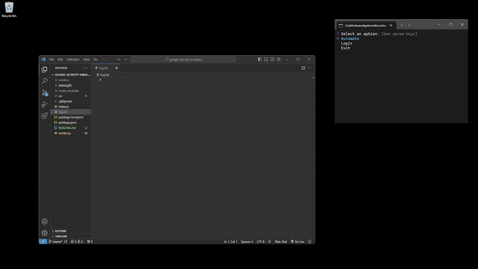

# Google Activity Simulator with Playwright

#### Introduction

Google reCAPTCHA uses a score system to determine the difficulty of the CAPTCHA presented to a user.

Two main factors affect the score: **IP address** and **activity** on the Google account.

You can check your score [here](https://recaptcha-demo.appspot.com/recaptcha-v3-request-scores.php).

#### Score Table

| Score | reCAPTCHA v2 | reCAPTCHA v3 |
|-------|--------------|--------------|
| **0.9** | None or easiest CAPTCHAs to solve, e.g., 'select 3 images, 1 page' | Invisible |
| **0.7** | Moderate CAPTCHA to solve, e.g., 'select 3 images, 2-3 pages' | Invisible |
| **0.3** | Slow-fading CAPTCHAs | Easiest CAPTCHAs to solve |
| **0.1** | Hardest CAPTCHAs, may need to complete multiple times | Slow-fading CAPTCHAs |

#### Aim

This app aims to replicate Google interactions by simulating activity on Google services, such as Search, Docs, and YouTube. By doing so, the account's internal Google score should increase over time.

#### To Do

- [ ] Proxy support
- [ ] CAPTCHA checkpoint detection

# Demo

**Note:** Headless mode is disabled for this demo. Browsers won’t be visible during regular automation, except for `signIn` and `checkScore`.

### Interactions

- Random Search


- YouTube


- Tab interaction


### Utilities

- Sign In


- Check Score


- Log


# Logic

The `Session` class is used to handle each account session, with most methods located here. You must run `init()` and then `search()`. Afterward, you can perform any of the interactions. The `randomInteraction()` method randomizes the interactions for you.

`Index.js` handles the UI and creates the processes, which call `worker.js` for each account saved.

`worker.js` contains an example script that will `init()`, then loop through `search()` -> `randomInteraction()` with 10-minute intervals.

**Note:** `signIn` and `checkScore` run their own separate scripts and both require headless mode to be turned off.

# Installation

Make sure to install [node.js](https://nodejs.org/en). Clone the repository, install dependencies, and launch:

```bash
git clone https://github.com/9bn1dyp/google-activity-simulator
cd google-activity-simulator
npm install
npx playwright install chromium
node index.js
```

After launch, sign into some accounts, the app will save the cookie files in /cookies. And then run the automation script, you can see what the accounts are doing or investigate any errors in log.txt.